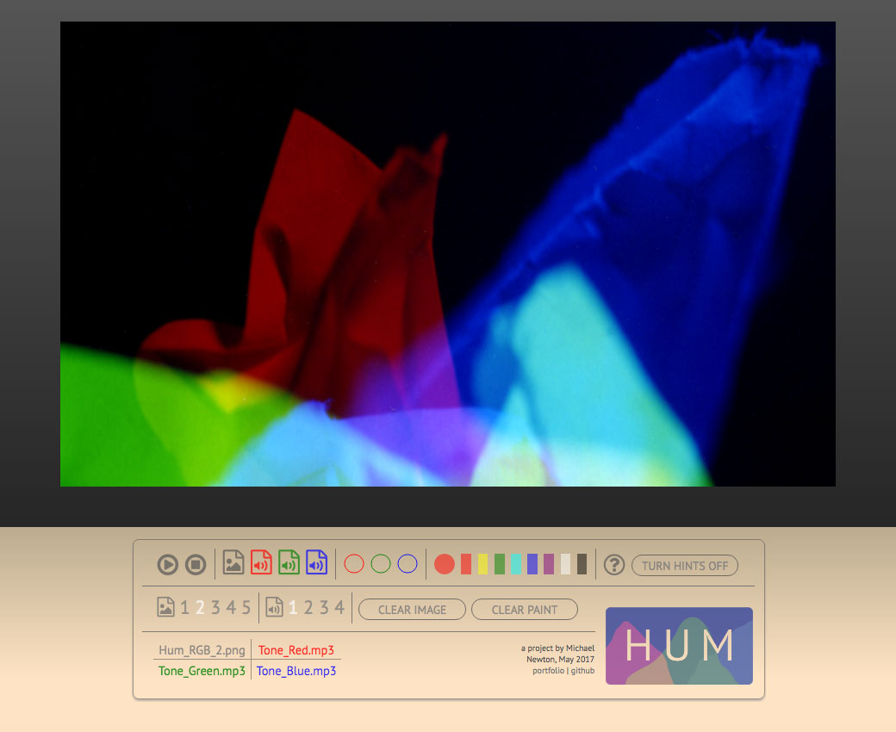
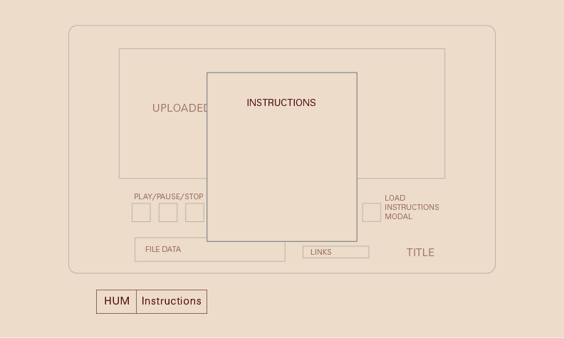

## Hum

[Hum live][app]

[app]: http://www.one-timepad.com/hum

**Hum** is a color-based, visual music/audio mixer and musical instrument. It's built with JavaScript, HTML5/Canvas, and CSS3. The goal of this project is to create a fun and intuitive music-making tool which can be easily used by people without much musical experience.

## Features & Implementation

### Audio controlled via color data

In Hum, three channels of audio are modified via the imagery in the central canvas element: the red, green and blue color channels in the canvas each modify the levels of one of three audio tracks. The individual tracks are loaded and played using an implementation of the HowlerJS library.

When a user hits the play button, they will see a playhead moving across the canvas; the speed/duration is determined by the shortest of the three audio tracks in use. At each point in the playback, the audio levels are determined by the relative amount of red, green and blue in that slice of the canvas. This was implemented with the JavaScript/Canvas `getImageData()` function, which returns color value as an array of integers. I wrote algorithms to calculate the amount of each color relative to the overall image size, and then change the audio levels accordingly.

### File uploads and sample files

Users may upload their own audio and image files. This was implemented with HTML file inputs and the HTML5 File API, with additional error handling to determine that the file has the proper extension.

If a user chooses not to use their own files, they can just use the preloaded samples. There are 5 sample images (all abstract combinations of red, green and blue) and 4 sample sets of multitrack audio (a sustained tone, a beat, a jazz band, and a choir, respectively), meant to show the capabilities of Hum.

### Follows

Users may 'follow' other users by clicking on a modular React component. In addition to the user's information, each user profile page contains three feeds: stories and responses written by that user, stories and responses which have been liked by that user, and stories and responses by users followed by that user. This information is quickly retrieved from the server thanks to a series of associations between multiple database tables (`users`, `stories`, `responses`, `likes`, `follows`, and `followings`). Users may view these feeds by clicking on a custom SVG icon menu.

Below is an initial wireframe drawing of the user profile page:

### Likes

Through the Rails backend, stories are associated with topics and can be 'liked' by users. Database associations allow for a record of all stories and responses that any user has liked. By comparing data from the `likes` table with user information, various React components can detect whether or not the logged-in user has liked a story or response, updating their styles accordingly.

The goal was to seamlessly integrate the experience of 'liking' into the site, i.e. by showing a story's 'likes' in a sidebar that appears and disappears according to the user's positiion in the story (via JavaScript and CSS).

## Future Directions for the Project

In addition to the features already implemented, I plan to continue work on this project.

### Search

By utilizing the pg-search Ruby gem, I can integrate text-based search into the site.

### Highlights

Medium allows users to highlight sections of stories that they particularly like. It would be possible to achieve a similar functionality on Message by storing information about each highlighted passage in the database and rendering the highlights via CSS.
